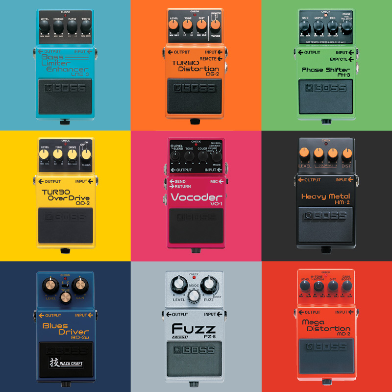

# **Audio Effects Classifications**

## **Overview**

This project implements a classifier system able to predict the audio effects used in recordings of electric guitar focusing in particular on distinguishing clean (no FX), distortion, and tremolo signals. 

The audio dataset is taken from the [IDMT-SMT-Audio-Effects database](https://www.idmt.fraunhofer.de/en/business_units/m2d/smt/audio_effects.html), which is a large dataset for automatic detection of audio effects in recordings of electric guitar and bass and related signal processing.

To develop the classification algorithm, the following features are considered: 

- Mel-frequency cepstral coefficients (MFCCs) 
- Total harmonic distortion (THDN)
- Envelope Flatness
- Root Mean Square Energy (RMSE) 
- Spectral Centroid
- Spectral Bandwidth 
- Spectral Flatness 
- Spectral Rolloff
- Zero-Crossing Rate

Then they are analysed using the SelectKBest function from the scikit-learn library, which selects features according to the k highest scores. This ensures that only the most effective features are considered in the classifier. 

Two classification approaches are studied here:

- Supervised learning with support vector machines (SVMs) from scikit-learn library.
- Sequential neural network approach based on the tensorflow library. 

## **Classification Results**
To demonstrate the effectiveness of both classification approaches, the main results are shown below (a more detailed description can be found in the report). They are presented in the form of confusion matrices. Clearly, classification accuracy is high (above 90%) for all three classes, with confusion matrices reflecting that. 

### SVM Confusion Matrix

### Neural Network Confusion Matrix

## **Project report with detailed discussion and results**
[Project Report](https://drive.google.com/file/d/1jlpFdKpSKTPbujZWrzrZmOu9c8UnCVsU/view?usp=sharing)
 
## **Note** 
To run the code properly, it is reccomended to use **[this dataset](https://drive.google.com/drive/folders/13iT-wDLOzV7XQOBOuZF7TiovgK9oDecQ?usp=sharing)**, which has only the audio files that are concerned with this project(from the aforementioned database). It is also important to pay attention to the external file path within the code to ensure correct access to this dataset.
